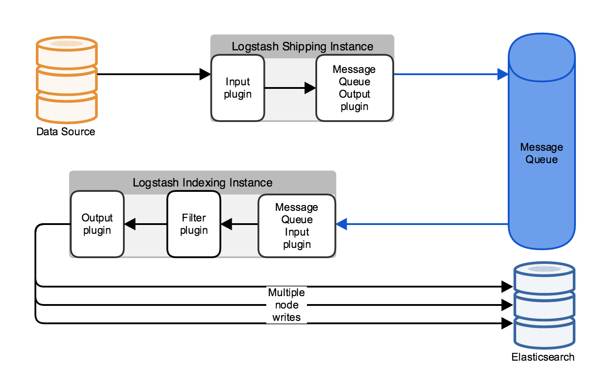

<!-- .slide: data-background="images/esbackground.png" data-state="eslogo" -->
# Ingesting data
#<!-- .element: class="fragment fade-out" data-fragment-index="1" --> to Elasticsearch

[Igor Motov](https://github.com/imotov)/[@imotov](http://twitter.com/imotov)


### About Me

* Software Developer at Elastic
* Joined: Oct 2012
* Contributing to Elasticsearch core since Apr 2011 
* Co-organizer of [Boston Elasticsearch Meetup](http://www.meetup.com/Elasticsearch-Boston/) 


### About Elastic

* Founded: July 2012
* Renamed Elasticsearch → Elastic: Mar 2015
* Headquaters: Amsterdam and Mountain View, CA
* Develops Elasticsearch, Logstash, Beats, Kibana
* Provides:
  * Training (public and on site)
  * Development and production support
  * Hosted Elasticsearch (Found)
  * Commercial plugins: Marvel, Shield, Watcher


### About Elasticsearch 

* A real-time search and analytics engine
  * JSON-oriented, Apache Lucene-based
* Automatic Schema Detection
  * With full control of the schema when needed
* Distributed
  * Scales Up+Out, Highly Available
* Multi-tenancy
  * Dynamically create/delete indices
* API centric
  * Most functionality is exposed through an API


## Powerful search and analytics engine


## Yet completely useless unless you can get some data into it


## Data Ingestion


### A variety of needs and solutions


Note: the most difficult part about data ingestion is that there is no one side fits all solution. Everybody has different needs.


## Data Ingestion Stages

* Data acquisition
  * Primary data source (SQL), Data generating apps, etc.
* Data transformation
  * Filtering, augmentation, normalization
* <!-- .element: class="fragment" data-fragment-index="1" --> Queueing/Buffering
  * Dealing with traffic spikes and other scalability issues
* Indexing/Shipping
  * Sending data to elasticsearch and/or other targets

Note:
Typically forms a pipeline


## Data Ingestion Stages

* Acquisition - **<!-- .element: class="fragment" data-fragment-index="1" -->logstash** **<!-- .element: class="fragment" data-fragment-index="2" -->and beats**
* Transformation - **<!-- .element: class="fragment" data-fragment-index="1" -->logstash**
* Buffering - **<!-- .element: class="fragment" data-fragment-index="1" -->logstash**
* Indexing - **<!-- .element: class="fragment" data-fragment-index="1" -->logstash** **<!-- .element: class="fragment" data-fragment-index="2" -->and beats**

Note:
Today we will talk about two products that can help companies with developing of their ingestion pipelines: logstash and beats


## Logstash
<!-- .element: class="plain" -->


### Logstash

* Data collection engine
* Open source, Apache License
* Pluggable pipeline architecture
* Community-extensible and developer-friendly plugin ecosystem


### Simple Logstash configuration

<!-- .element: class="plain" -->


### Logstash configuration

```ruby
# acquisition  
input { ... }

# transformation  
filter { ... }

# indexing
output { ... }
```


## Logstash inputs - acquisition

* input produce an object that consits of key/value pairs
* logstash pushes this object into the pipeline


### Logstash inputs 

* Primary Data Source
    * SQL databases (via jdbc)
    * Couch DB
    * Redis 
    * ...
* Event generating apps
    * Files
    * Windows event log
    * TCP, UDP, HTTP (pull and push), XMPP
    * Kafka, rabbitmq
    * ...


### Log file input

```ruby
input {
  file {
    path => "/var/log/http.log"
  }
}
```

<!-- .element: class="fragment" data-fragment-index="1" -->produces objects like this:

<pre class="fragment" data-fragment-index="1"><code class="ruby">{
       "message" => "55.3.244.1 GET /index.html 15824 0.043",
      "@version" => "1",
    "@timestamp" => "2016-01-14T20:36:59.706Z",
          "host" => "gejigeji.local" 
}
</code></pre>


### JDBC input

```ruby
input {
  jdbc {
    jdbc_driver_library => "mysql-connector-java-5.1.36-bin.jar"
    jdbc_driver_class => "com.mysql.jdbc.Driver"
    jdbc_connection_string => "jdbc:mysql://localhost:3306/mydb"
    jdbc_user => "mysql"
    schedule => "* * * * *"
    statement => "SELECT * from my_data where TIME_STAMP >= :sql_last_start"
  }
}
```


## Logstash filters - transformation

* grok 
* anonymize
* geoip
* xml
* date
* ...


### Grok filter example

```ruby
input {
  file {
    path => "/var/log/http.log"
  }
}
filter {
  grok {
    match => { "message" => "%{IP:client} %{WORD:method} 
      %{URIPATHPARAM:request} %{NUMBER:bytes} %{NUMBER:duration}" }
  }
}
```
```nohighlight
WORD \b\w+\b
...
BASE10NUM (?<![0-9.+-])(?>[+-]?(?:(?:[0-9]+(?:\.[0-9]+)?)|(?:\.[0-9]+)))
NUMBER (?:%{BASE10NUM})
...
IPV6 ((([0-9A-Fa-f]{1,4}:){7}([0-9A-Fa-f]{1,4}|:))|(([0-9A-Fa-f]{1,4}:){6}(:[0-9A-Fa-f]{1,4}|((25[0-5]|2[0-4]\d|1\d\d|[1-9]?\d)(\.(25[0-5]|2[0-4]\d|1\d\d|[1-9]?\d)){3})|:))|(([0-9A-Fa-f]{1,4}:){5}(((:[0-9A-Fa-f]{1,4}){1,2})|:((25[0-5]|2[0-4]\d|1\d\d|[1-9]?\d)(\.(25[0-5]|2[0-4]\d|1\d\d|[1-9]?\d)){3})|:))|(([0-9A-Fa-f]{1,4}:){4}(((:[0-9A-Fa-f]{1,4}){1,3})|((:[0-9A-Fa-f]{1,4})?:((25[0-5]|2[0-4]\d|1\d\d|[1-9]?\d)(\.(25[0-5]|2[0-4]\d|1\d\d|[1-9]?\d)){3}))|:))|(([0-9A-Fa-f]{1,4}:){3}(((:[0-9A-Fa-f]{1,4}){1,4})|((:[0-9A-Fa-f]{1,4}){0,2}:((25[0-5]|2[0-4]\d|1\d\d|[1-9]?\d)(\.(25[0-5]|2[0-4]\d|1\d\d|[1-9]?\d)){3}))|:))|(([0-9A-Fa-f]{1,4}:){2}(((:[0-9A-Fa-f]{1,4}){1,5})|((:[0-9A-Fa-f]{1,4}){0,3}:((25[0-5]|2[0-4]\d|1\d\d|[1-9]?\d)(\.(25[0-5]|2[0-4]\d|1\d\d|[1-9]?\d)){3}))|:))|(([0-9A-Fa-f]{1,4}:){1}(((:[0-9A-Fa-f]{1,4}){1,6})|((:[0-9A-Fa-f]{1,4}){0,4}:((25[0-5]|2[0-4]\d|1\d\d|[1-9]?\d)(\.(25[0-5]|2[0-4]\d|1\d\d|[1-9]?\d)){3}))|:))|(:(((:[0-9A-Fa-f]{1,4}){1,7})|((:[0-9A-Fa-f]{1,4}){0,5}:((25[0-5]|2[0-4]\d|1\d\d|[1-9]?\d)(\.(25[0-5]|2[0-4]\d|1\d\d|[1-9]?\d)){3}))|:)))(%.+)?
IPV4 (?<![0-9])(?:(?:25[0-5]|2[0-4][0-9]|[0-1]?[0-9]{1,2})[.](?:25[0-5]|2[0-4][0-9]|[0-1]?[0-9]{1,2})[.](?:25[0-5]|2[0-4][0-9]|[0-1]?[0-9]{1,2})[.](?:25[0-5]|2[0-4][0-9]|[0-1]?[0-9]{1,2}))(?![0-9])
IP (?:%{IPV6}|%{IPV4})
```


### Grok filter

Input:
```ruby
{
   "message" => "55.3.244.1 GET /index.html 15824 0.043"
   ...
}
```

Output:
```ruby
{
  "message" => "55.3.244.1 GET /index.html 15824 0.043"
  ...
  "client" => "55.3.244.1"
  "method" => "GET"
  "request" => "/index.html"
  "bytes" => "15824"
  "duration" => "0.043"
}
```


## Logstash output - indexing/shipping

* elasticsearch
* solr_http
* hipchat
* kafka
* rabbitmq
* ...


### Elasticsearch output example

```ruby
output {
  elasticsearch {
    hosts => 'localhost'
    index => 'my_data'
  }
}
```


## Buffering
<!-- .element: class="plain" -->


### Kafka can be both input and output

Logstash shipper configuration:
```ruby
input {
  file {
    path => "/var/log/http.log"
  }
}
output {
  kafka {
    topic_id => "my_logs"
  }
}
```


### Kafka can be both input and output

Logstash indexer configuration:
```ruby
input {
  kafka {
    topic_id => "my_logs"
  }
}
filter {
  ...
}
output {
  elasticsearch {
    hosts => 'localhost'
    index => 'my_data'
  }
}
```


## Beats

<!-- .element: class="plain" -->


### Beats

* Light-weight data acquisition and shipping mechanism
* Open source, Apache License
* Written in go
* Can send results to Elasticsearch or Logstash


### Beats

* Packetbeat
  * capture network packets
* Topbeat
  * gather CPU, memory, and other per-process and system wide data
* Filebeat
  * collects, pre-processes, and forwards log files
* {Your}beat (using Libbeat)
  * the open source framework for building Elasticsearch data shippers, BYOB


### Beats platform
<!-- .element: class="plain" -->


### [www.elastic.co/products/beats/](https://www.elastic.co/products/beats/)
<!-- .element: class="plain" -->


## https://www.elastic.co/
<!-- .element: class="plain" -->


## ELASTIC{ON} <sup>'16</sup>
* Feb 17-19, 2016
* Pier 48, San Francisco, CA
* https://www.elastic.co/elasticon


## Questions?

* Slides: https://imotov.github.io/presentations
* Twitter: [@imotov](http://twitter.com/imotov)


### The end