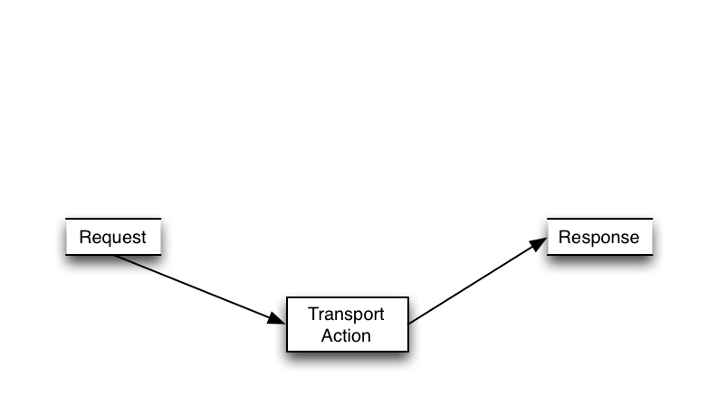
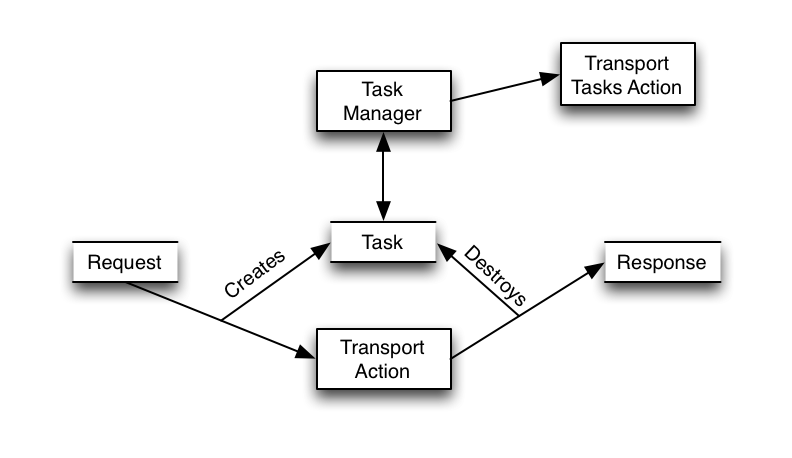
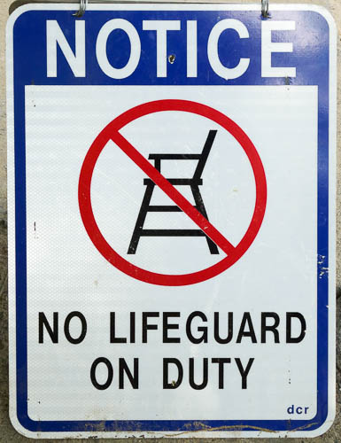

<!-- .slide: data-background="images/esbackground.png" data-state="eslogo" -->
# A Quick Intro into Task Management API

[Igor Motov](https://github.com/imotov)/[@imotov](http://twitter.com/imotov)

## Task Manager API

* API for monitoring and controlling currently running tasks
  * Show which tasks are currently running
  * Cancel tasks
  * Send other commands to tasks

## What's a task? (High Level)

* Any activity started by
  * a user through client or REST API
    * Ex: node stats running on coordinating node 
  * other activity using Transport mechanism
    * Ex: node stats running on all other nodes 
  * an internal service using Transport mechanism 
    * Ex: fault detection ping sent by a Zen Discovery Service

## What's a task? (Low Level)

A special object that represents a currently processed Transport Action request.

## Before Task Manager

## Task Manager

## Task

* Task Id
* Parent Task Id (if not a top level task)
* Action Name
* Time when task started
* Description (static)
* Status (dynamic)

## Tasks Actions

* Special type of action that can communicate to tasks 
* `TransportTasksAction`
  * `TransportListTasksAction` - list tasks action
  * `TransportCancelTasksAction` - cancel tasks action
  * `TransportRethrottleAction` - throttle tasks action

## DEMO

## Plans

* Task list and cancellation (DONE)
* Persistence of long running task results (IN PROGRESS)
* Survival of coordinating node

## Questions?

* Slides: https://imotov.github.io/presentations

## The end