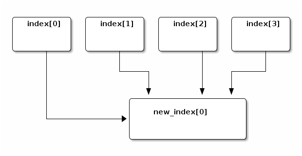
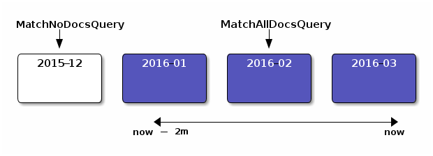

<!-- .slide: data-background="images/esbackground.png" data-state="eslogo" -->
# What's new in Elasticsearch 5.0

[Igor Motov](https://github.com/imotov)/[@imotov](http://twitter.com/imotov)


## Why 5.0?

Wait, wasn't the last version of Elasticsearch 2.4?

Why the sudden jump to 5.0?


### Current Elastic Stack

-   Elasticsearch - **v2.4.1**
-   Logstash - **v2.4.0**
-   Kibana - **4.6.1**
-   Beats  - **1.3.1**


### Elasticsearch 5.0

-   Elasticsearch - **v5.0.0**
-   Logstash - **v5.0.0**
-   Kibana - **v5.0.0**
-   Beats - **v5.0.0**
-   X-Pack - **v5.0.0**


### Unified releases

We are trying to make it easier to keep track of the different products as well as having unified release schedules.

So the Elasticsearch 5.1 release will mean Logstash 5.1, Kibana 5.1, and Beats 5.1 will all be released at the same time.

Note:
We're also trying to do a cadence-based release process, meaning people can "count" on releases at certain times.

Since Kibana was already on 4.x, it meant in order to have common numbering we have to jump to 5.0 as the next major release.


### Release Themes

-   Elasticsearch Features
-   Query changes
-   Mapping changes
-   Resiliency changes
-   Lucene and other changes

Note:
Here are major "theme" changes we'll be talking about


## New Features

Let's talk about the new and improved things!

Note:
There are lots of new features and changes, we hope these new features can address a lot of suggestions and comments we've received, so thanks for the feedback!


## Feature: Ingest Node

[elastic.co/guide/en/elasticsearch/reference/master/ingest.html](https://www.elastic.co/guide/en/elasticsearch/reference/master/ingest.html)

This is a new type of node that can be used to transform your data when it is received. Think of it as a little bit of Logstash built into Elasticsearch.


### Defining a Pipeline

There are a set of APIs dedicated to adding, retrieving, and removing pipelines. Additionally, pipeline changes take effect immediately so
they can be dynamically updated.


### Defining a Pipeline

```javascript
PUT /_ingest/pipeline/my-pipeline
{
  "description": "my pipeline for extracting info from logs",
  "processors": [{
    "grok": {
      "field": "message",
      "pattern": "%{IP:client} %{WORD:method} %{URIPATHPARAM:req} ⏎
                        %{NUMBER:bytes} %{NUMBER:duration}"
    }
  }, {
    "convert": {
      "field" : "duration",
      "type": "integer"
    }
  }]
}
```


### Indexing a document using a pipeline

When you index a document, you can specify the pipeline to be used for processing it:

```es
POST /i/doc/1?pipeline=my-pipeline
{
  "message": "127.0.0.1 POST /things 100 78"
}
```


### Indexing a document using a pipeline

```es
GET /i/doc/1?pretty

{
  "_index" : "i", "_type" : "doc", "_id" : "1", "_version" : 1,
  "found" : true,
  "_source" : {
    "duration" : 78,
    "req" : "/things",
    "method" : "POST",
    "bytes" : "100",
    "client" : "127.0.0.1",
    "message" : "127.0.0.1 POST /things 100 78"
  }
}
```


### Lot of processors available

-   Append
-   Convert
-   Date
-   Foreach
-   Grok
-   Gsub
-   Join
-   Remove
-   Rename
-   Split
-   .. And many more!


## Feature: Shard Indexing buffer now splits based on activity

[github.com/elastic/elasticsearch/pull/14121](https://github.com/elastic/elasticsearch/pull/14121)

Previously, Elasticsearch would take 10% of the JVM memory and split it evenly across all **active** shards, so 10 active shards means each shard would get 1% of the heap to use as an indexing buffer.


### Shard indexing buffer in 5.0

In 5.0, Elasticsearch gives shards that have heavy indexing a larger portion of the indexing buffer in the JVM heap.

-   Smoother IO pressure
-   Reduced merge pressure
-   Faster indexing throughput for active shards

Note:
This is okay in theory, but what happens if someone saves a Kibana dashboard, or gathers some metrics with Marvel? Do those very infrequently modified indices need to take up an equal portion of the heap as


## Feature: Index Shrinking

It's a common use case when indexing time-based data to create an index with multiple shards to get the ingestion performance desired.

But, what happens when you're done indexing? Now you might have more shards than you need for querying.


This is a new API that lets you "shrink" an existing index into a new index with different settings

```es
// Shrink "index" into "new_index" created with the settings given
POST /index/_shrink/new_index
{
  "settings": {
    "index.number_of_shards": 1
  }
}
```


An index with four shards shrunk into a new index with a single shard




## Feature: An API for rolling over time-based indices

Lot's of people use time-based indices, for a couple of reasons:

-   Retention policies
-   Indexing/search performance


Now that we have the `/_shrink` API for collapsing multiple shards into a single shard, it would be great to be able to segment indices by "conditions" like:

-   Maximum number of documents
-   Maximum age of the index


Let's say we create an index "foo-000001" with two aliases, one for indexing and one for search:

```es
PUT /foo-000001
{
  "aliases": {"foo_index": {}, "foo_search": {}}
}
```


The `/_rollover` API can be periodically called to "roll-over" the index if any of the conditions are met. By "roll-over" we mean creating a new index and updating the alias(es).


So `/_rollover` is called with the conditions and any optional settings for a newly created index

```es
POST /foo_index/_rollover
{
  "conditions": {
    "max_docs": 1000,
    "max_age": "7d"
  },
  "settings": {
    "index.number_of_shards": 2
  }
}
```


And returns something like:

```js
{
  "old_index": "foo-000001",
  "new_index": "foo-000002",
  "rolled_over": true,
  "dry_run": false,
  "conditions": {
    "[max_age: 7d]": false,
    "[max_docs: 1000]": true
  }
}
```

The new "foo-000002" index is created with the same settings as the original "foo" and the "foo\_index" and "foo\_search" aliases are updated.


## Feature: A new scripting language: Painless

[elastic.co/guide/en/elasticsearch/reference/master/modules-scripting-painless.html](https://www.elastic.co/guide/en/elasticsearch/reference/master/modules-scripting-painless.html)

Elasticsearch 5.0 includes a new scripting language designed to be fast and secure called "Painless".


It takes a lot of cues from Groovy and Lucene Expressions, and is developed by the person behind Lucene Expressions.

```groovy
int total = 0;
for (int i = 0; i < doc['things'].length; ++i) {
  total += doc['things'][i];
}
return total;
```

Note:
We've been working hard on trying to make scripting both fast and secure which led us to create our own language, Painless


### Improving scripting performance with type-safety

Painless includes a way to optionally specify types which means the compiler can reduce lookups and significantly improve performance


Dynamic type version:

```groovy
def first = doc.first.0;
def last = doc.last.0;
return first + " " + last;
```

And the annotated version:

```groovy
String first = (String)((List)((Map)doc).get("first")).get(0);
String last = (String)((List)((Map)doc).get("last")).get(0);
return first + " " + last;
```

Note:
The annotated version is completely optional, but by providing typing it can be more efficient than the dynamic version.

We're working on closing the distance between the dynamic and the static version as much as possible.


## Feature: Instant Aggregations

Queries have been completely refactored in 5.0, they are now parsed on the coordinating node and serialized to different nodes in a binary format.

We can do cool things now with this!


### Making Aggregations Instant

Assume you have four monthly indices and a query/aggregation from "`now`" to "`now-2m`" (now minus two months)


Usually a query like this could not be cached at all, because it uses the "now" word and "now" is always changing


However, if you **know** that the 2016-02 shard's minimum and maximum values lie within the bounds of the query, the query can be rewritten to a `match_all` query.




-   A `MatchAllDocsQuery` can easily be cached
-   The shard query cache is enabled by default in ES 5.0 (1% of JVM heap)
-   Other shards outside of this range (2015-12) can be rewritten to a `MatchNoDocsQuery` query and cached

This can drastically speed up aggregations and Kibana dashboards!


## Feature: A new completion suggester

The completion suggester has gained a lot of new features!


-   Document oriented suggestions:
    -   Near-real time
    -   Deleted document filtering (previously it included deleted documents)
    -   Multiple context support for filtering
-   Query Interface:
    -   Regular expression and typo tolerance via `regex` and `fuzzy`
    -   Context boosting at query time
-   Can now return the entire document in additional phase (`payload` unneeded)


## Feature: An API to explain why shards aren't assigned

"Why are my shards unassigned?"


There is a new API introduced in 5.0.0 to answer that question, this is what it looks like:

```es
// Specify the index, shard number, and primary/replica boolean of the
// shard to explain
POST /_cluster/allocation/explain
{
  "index": "myindex",
  "shard": 2,
  "primary": false
}
```


```es
{
  "shard" : { ... },                         // shard information
  "assigned" : false,                        // shard is not assigned
  "shard_state_fetch_pending": false,
  "unassigned_info" : {
    "reason" : "INDEX_CREATED",              // the reason this shard
    "at" : "2016-04-26T16:34:53.227Z"        // was initially unassigned
  },
  "allocation_delay_ms" : 0,                 // delay before assigning
  "remaining_delay_ms" : 0,
  "nodes" : {
    "z-CbkiELT-SoWT91HIszLA" : {
      "node_name" : "QD1MtxF",
      "node_attributes" : { },
      "store" : {
        "shard_copy" : "NONE"                // node has no copy of data
      },
      "final_decision" : "NO",               // final decision is "NO"
      "final_explanation": "the shard cannot be assigned because one
                            or more allocation decider returns a
                            'NO' decision",
      "weight" : 5.0,
      "decisions" : [ {                      // list of decisions
        "decider" : "same_shard",            // preventing allocation
        "decision" : "NO",                   // on this node
        "explanation" : "the shard cannot be allocated on the same
                         node id [z-CbkiELT-SoWT91HIszLA] on which
                         it already exists"
      } ] } } }
```

Note:
The cluster allocation explain API shows the decision for each node in the cluster, so you can see why a shard can or can't be assigned to each node. It also shows the weight for each node as well as any error associated with the on-disk copy of the shard (the store info)


## Feature: Low-level Java REST client

Finally! [A Java REST client](https://github.com/elastic/elasticsearch/pull/18735/) that isn't tied to ES version, so it can be used just like any other Java client. It will have a separate maven artifact and will be compatible with Java 1.7+

There will also be asynchronous versions of the APIs in addition to the blocking ones.


```java
RestClient client = RestClient.builder()
    .setHosts(new HttpHost("localhost", 9200)).build();
HttpEntity body =
    new StringEntity("{\"query\": {\"match_all\": {}}}", "UTF-8");
Map<String, String> params = new HashMap<>();
params.put("pretty", "true");

ElasticsearchResponse resp =
    client.performRequest("POST", "/_search", params, body);
System.out.println("got: " + resp.getEntity());
```


## Feature: Re-index From Remote

Now that we have a REST client, an Elasticsearch cluster can pull from a different cluster and re-index into our current cluster. This is a great way to upgrade if you have the hardware for two clusters!

```es
POST /_reindex
{
  "source": {
    "remote": { "host": "http://otherhost:9200" },
    "index": "my-index",
    "query": { ... }
  },
  "dest": { "index": "my-new-index" }
}
```

Remote hosts **must** be explicitly white-listed in the `reindex.remote.whitelist` setting.


## But wait, there is more!


## Query changes

-   The great query refactor!
    -   All queries are now parsed on the coordinating node and serialized in a binary format
-   Scan and count APIs are gone
    -   Replace scan by sorting on `_doc`
    -   Replace count API by `size: 0` in queries
    -   Scrolls can now be partitioned into multiple slices to be processed in parallel

-   A new query feature, `search_after` for efficient pagination


### Query changes (cont.)

-   Percolate API is replaced by the percolate query
    -   Scoring support added as well
-   Aggregations have a circuit breaker for bucket count and can automatically switch to `breadth_first` mode when prudent

Note:
By parsing queries earlier in the pipeline, we don't have to parse them on each coordinating node and can do things like rewrite them earlier to be more efficient (as is the case with instant aggs)


## Mapping changes

-   Use either `text` or `keyword` instead of "string" for string fields in mappings
    -   `text` means the field is used for full-text search
    -   `keyword` means the field will be not analyzed and can be used in aggs or exact matches
    -   doc\_values are enabled by default on `keyword` fields
-   IPv6 support for ip fields (BigInteger coming soon)
-   New numeric types, `half_float` and `scaled_float` have been added


```es
POST /myindex
{
  "mappings": {
    "doc": {
      "properties": {
        "body": {
          "type": "text",   // fully analyzed, no doc_values
          "analyzer": "english"
        },
        "tags": {
          "type": "keyword" // not analyzed, uses doc_values
        },
        "price": {
          "type": "scaled_float",
          "scaling_factor": 100
        }
      }
    }
  }
}
```

Note:
By separating the string field we can start to specialize the uses of each. This means allowing doc\_values on the keyword field while still allowing the use of some analysis (like lower-casing)

IPv6 support is finally here thanks to Lucene points, we're hoping to add BigInteger soon as well

A `half_float` is a float represented with 16 bits instead of 32, and a `scaled_float` allows you to specify a scaling factor to be used, internally the number is represented as an integer, which means better compression.


## Resiliency changes

Lots of changes have been added to make Elasticsearch safer, and to reduce the possibility of mis-configuration that could easily have been avoided.


### Startup checks

A number of checks have been added that run when Elasticsearch starts

-   Maximum number of processes check
-   Check maximum number of file descriptors
-   Minimum and maximum heap should match
-   Add mlockall bootstrap check (if you use, it, make sure it takes effect)


If started with a non-local address, these are hard errors instead of warnings:

```fundamental
$ bin/elasticsearch -E network.host=10.0.0.216
[node      ] [QD1MtxF] initializing ...
[env       ] [QD1MtxF] using [1] data paths, mounts [[/home (/dev/mapper/fedora_ivalice-home)]] ...
[env       ] [QD1MtxF] heap size [494.9mb], compressed ordinary object pointers [true]
[node      ] [QD1MtxF] version[5.0.0-alpha6-SNAPSHOT], pid[9240], ...
[plugins   ] [QD1MtxF] no plugins loaded
[node      ] [QD1MtxF] initialized
[node      ] [QD1MtxF] starting ...
[bootstrap ] [] uncaught exception in thread [main]
org.elasticsearch.bootstrap.StartupError: java.lang.RuntimeException: bootstrap checks failed
max virtual memory areas vm.max_map_count [65530] likely too low, increase to at least [262144]
  at org.elasticsearch.bootstrap.BootstrapCheck.check(BootstrapCheck.java:125)
  at org.elasticsearch.bootstrap.BootstrapCheck.check(BootstrapCheck.java:85)
  at org.elasticsearch.bootstrap.BootstrapCheck.check(BootstrapCheck.java:65)
  at org.elasticsearch.bootstrap.Bootstrap$5.validateNodeBeforeAcceptingRequests(Bootstrap.java:191)
  at org.elasticsearch.node.Node.start(Node.java:323)
  ... etc ...
```

Note:
You might see these warnings on a development machine when starting logged as warnings, as soon as you deploy into production they'll change from warnings into hard stops that will prevent Elasticsearch from starting up


### Settings Infrastructure overhaul

-   Settings can now be "unset" (set to `null`) to revert to the default setting

```es
PUT /_cluster/settings
{
  "transient": {
    // will reset this setting to the default
    "threadpool.bulk.queue_size": null
  }
}
```


-   All settings can shown by adding `include_defaults` to requests

```es
// will return every setting along with the default values
GET /_cluster/settings?include_defaults
```

-   Settings are transactionally applied and reset
-   Index level settings now cannot be configured on a node level

Note:
Settings can finally be reset and you can see all the default values for the settings from the REST API


### Cluster safety

[elastic.co/guide/en/elasticsearch/resiliency/master/](https://www.elastic.co/guide/en/elasticsearch/resiliency/master/index.html)

-   Add two phased commit to Cluster State publishing
-   Allocate primary shards based on allocation IDs
-   Do not promote stale copies of shards to primary
-   Acknowledge replica failures before write acknowledgment
-   Persistent node names across restarts
-   Many more (see the resiliency page for the full list)

Note:
There are a lot of safety and resiliency changes, more than I can go over here, check out the page for the entire list


## Lucene changes

Elasticsearch 5.0.0 will use Lucene 6.2, a major version upgrade of Lucene

-   Big performance improvements!
-   [BM25](https://www.elastic.co/elasticon/conf/2016/sf/improved-text-scoring-with-bm25) by default for scoring
-   Lucene 6.0 introduces a new fast and efficient numeric format called [points](https://www.elastic.co/blog/lucene-points-6.0)
    -   Based on a balanced K-D tree <https://en.wikipedia.org/wiki/K-D-B-tree>


## A Note on Migration

- Indices created with 1.x will have to be reindexed

- Upgrading a 2.x cluster to 5.0 will require a full cluster restart!

- Just like the 1.x to 2.0 move, there is a tool to help you transition: [github.com/elastic/elasticsearch-migration/tree/2.x](https://github.com/elastic/elasticsearch-migration/tree/2.x)

- Always check the migration guide for the full list of changes you need to be aware of before upgrading Elasticsearch! [elastic.co/guide/en/elasticsearch/reference/master/breaking-changes-5.0.html](https://www.elastic.co/guide/en/elasticsearch/reference/master/breaking-changes-5.0.html)

Note:
As with any large upgrade, take backups and plan accordingly!


## Q&A