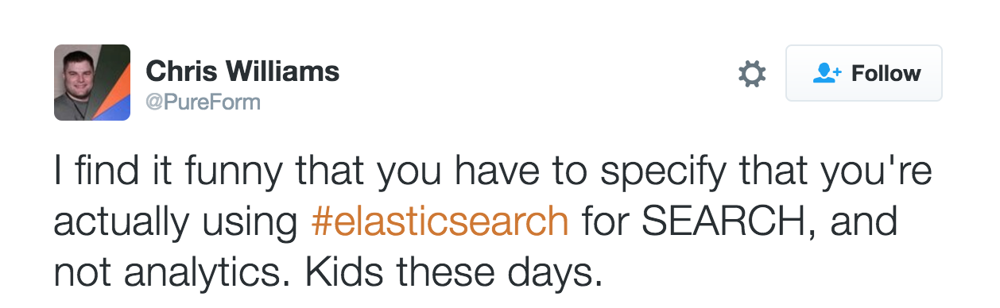
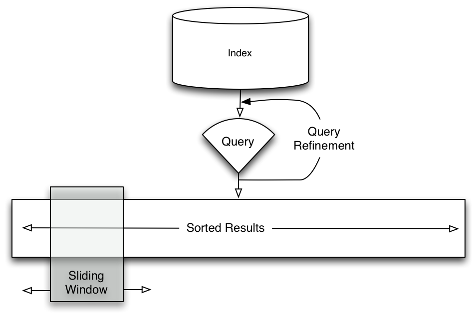
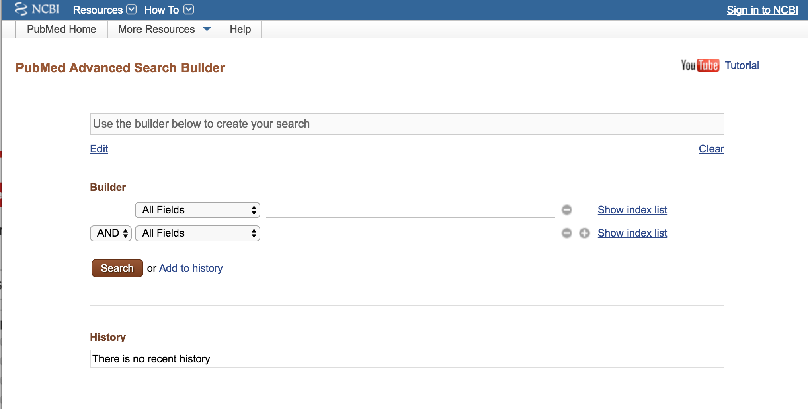
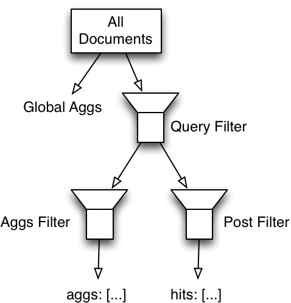
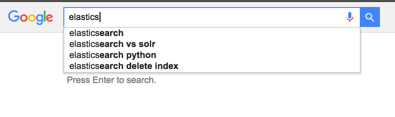
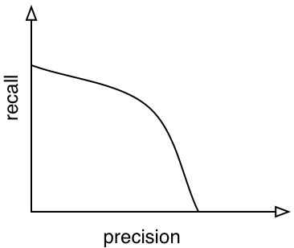

<!-- .slide: data-background="images/esbackground.png" data-state="eslogo" -->
# You know, 
# for search

[Igor Motov](https://github.com/imotov)/[@imotov](http://twitter.com/imotov)


### Inspiration for this talk

<iframe src="//www.youtube.com/embed/7G5F8ObYgjI" style="width: 580px; height: 326.25px;">
</iframe>


### Inspiration for this talk

<!-- .element: class="plain" -->


## About me

- Software engineer at elasticsearch
- "A Search guy" for several companies before that


### Using Elasticsearch to implement search in your application

- Mostly high-level overview of components of elasticsearch available for search
- With a few deep dives into common issue that affect search quality


### Components of Search Experience
### Case study

http://www.rei.com/

Note:
- search for socks (point out suggestions)
- point out sort order
- show how to step through pages
- show faceted navigation (select hiking socks)


<!-- .element: class="plain" -->


### Components of Search Experience

- Query and Query Refinement
- Sorting results
- Navigating through results


## Querying elasticsearch


### Single search box

<!-- .element: class="plain" -->


### Multiple boxes

<!-- .element: class="plain" -->


### Multiple boxes

<!-- .element: class="plain" -->


### Query Language

<!-- .element: class="plain" -->


### "Advanced" search

<!-- .element: class="plain" -->


### What about Google?

<!-- .element: class="plain" -->


### Single search box

```javascript
GET /my_index/my_type/_search
{
  "query": {
    "match": {
      "_all": ".... user query goes here ...."
    }
  }
}
```

<small>But we can do better than this as you will see later</small>


### Multi-box search

```javascript
GET /my_index/my_type/_search
{
  "query": {
    "bool": {
      "must": {"match": {"_all": ".... user query goes here ...."}},
      "filter": { ❶
        "bool": {
          "must": [
            {"range": {"price": {"gte": "100.00", "lt": "200.00"}},
            {"term": {"travel_type": "work"},
             ... other criteria ...
          ]
        }
      }
    }
  }
}
```

<small>❶ - we use filter because we don't want it to affect score</small><br/>


### Query Language - `query_string` query

```javascript
GET /my_index/my_type/_search
{
  "query": {
    "query_string": {
      "query": "boston AND from:joe AND label:important"
    }
  }
}
```

<small>Very sensitive to syntax mistakes, too powerful for most uses.</small> <br/>
<small>Use only if you really trust your users.</small> 


### Query Language - `simple_query_string` query

```javascript
GET /my_index/my_type/_search
{
  "query": {
    "simple_query_string": {
      "query": "\"fried eggs\" +(eggplant | potato) -frittata"
    }
  }
}
```

<small>Doesn't allow searches in fields</small><br/>
<small>Very configurable and doesn't fail with syntax errors</small> 


### Query Language

Best solution: write your own parser 


## Query refinement - Facets/Aggregations


### Facets/Aggregations
### Case study

http://www.rei.com/

Note:
- search for watches (point out suggestions)
- point out sort order
- show how to step through pages
- show faceted navigation (select orange watches)


### Aggregations

```javascript
GET /my_index/my_type/_search
{
  "query": {"match": {"_all": "watches"}},
  "aggs": {
    "by_color": {"terms": {"field": "color"}},
    "by_price": {"histogram": {"field": "price", "interval" : 50}},
    .... other aggregations ....
  }
}
```


### After user selected orange watches

```javascript
GET /my_index/my_type/_search
{
  "query": {
    "bool": {
      "must": {"match": {"_all": "watches"}},
      "filter": {"term": {"color": "orange"}}
    }
  },
  "aggs": {
    "by_color": {"terms": {"field": "color"}},
    "by_price": {"histogram": {"field": "price", "interval" : 50}},
    .... other aggregations ....
  }
}
```

<small>But that's not what we actually want.</small>


### Filtering of aggregations and hits

<!-- .element: class="plain" -->


### Filtering of aggregations and hits

```javascript
PUT /my_index/my_type/_search
{
  "query": {"match": {"_all": "watches"}},
  "post_filter": {"term": {"color": "orange"}},      ❶
  "aggs": {
    "by_color": {"terms": {"field": "color"}},       ❷
    "filter_aggs": {
      "filter" : {"term": { "color": "orange" }},    ❸
      "aggs" : {
        "by_price": {"histogram": {"field": "price", "interval" : 50}},
        .... other aggregations ....
      }
    }
  }
}
```

<small>❶ - only affects hits</small><br/>
<small>❷ - is not affected by color filter</small><br/>
<small>❸ - sets back color filter for all other aggregations</small>


## Suggestions

<!-- .element: class="plain" -->
<!-- .element: class="plain" -->


### Did you mean?

Use term or phrase suggesters

```javascript
POST /my_index/my_type/_suggest
{
  "did-you-main-suggestions" : {
    "text" : "ellasticsearch",
    "term" : {
      "field" : "title"
    }
  }
}
```


### Autocomplete

Use completion suggester

```javascript
POST /my_index/my_type/_suggest
{
  "completions-suggestions" : {
    "prefix" : "elastics",
    "completion" : {
      "field" : "suggest"
    }
  }
}
```


## Result navigation

- Sorting
- Paging


### Sorting

Sorts by relevancy by default.

```javascript
PUT /my_index/my_type/_search
{
  "query": {"match": {"_all": "watches"}},
  "aggs": {
        ...
  },
  "sort": [
    {"price": "asc"}
  ]
}
```


### Sorting 

Sort can work with multiple fields

```javascript
PUT /my_index/my_type/_search
{
  "query": {"match": {"_all": "watches"}},
  "aggs": {
        ...
  },
  "sort": [
    {"price": "asc"},
    {"_uid": "desc"}  ❶
  ]
}
```

<small>❶ - special internal field that contains id of each document</small><br/>


### Paging

Top 10 results is shown by default.

This can be changed by using `size` and `from` attributes

```javascript
PUT /my_index/my_type/_search
{
  "query": {"match": {"_all": "watches"}},
  "aggs": {
        ...
  },
  "sort": [
    {"price": "asc"},
    {"_uid": "desc"}
  ],
  "from": 60,
  "size": 30
}
```

<small>NOTE: doesn't affect aggregations.</small>


### "Infinite" scroll

https://twitter.com/search?f=tweets&vertical=default&q=elasticsearch&src=typd


### "Infinite" scroll - first request

```javascript
GET /my_index/my_type/_search
{
  "query": {"match": {"_all": "watches"}},
  "aggs": {
        ...
  },
  "sort": [
    {"price": "asc"},
    {"_uid": "desc"}
  ],
  "size": 100,
  "from": 0
}
```


### "Infinite" scroll - following requests

```javascript
PUT /my_index/my_type/_search
{
  "query": {"match": {"_all": "watches"}},
  "aggs": {
        ...
  },
  "sort": [
    {"price": "asc"},
    {"_uid": "desc"}
  ],
  "size": "100",
  "search_after": [123.00, "my_type#654323"]  ❶
}
```

<small>❶ - sort key returned with the last document on previous page</small><br/>
<small>avoid very deep pagination. `index.max_result_window` limits number of documents to return (defaults to 10,000)</small><br/>


## Improving relevancy


### Relevancy

- A floating point number that represent how close a document matches a query.
- Different ways to calculate it
- Elasticsearch 5.0 is using [Okapi BM25](https://en.wikipedia.org/wiki/Okapi_BM25) function 


### Precision vs Recall

What users want from search results?
- they want to get everything that they are looking for (recall)
- they don't want any "junk" to appear in results (precision)


### Total recall

```javascript
GET /my_index/my_type/_search
{
  "query": {
    "match_all": { }
  }
}
```


### Precision vs Recall curve

<!-- .element: class="plain" -->


### How to choose between precision and recall?

- Most users complain about precision 
  - they don't like looking at irrelevant results
  - they don't know about relevant records that they cannot find
- Lawyers and Doctors complain about recall 
  - price of missing a record can be very high


### Relevancy sorting really helps

- Increase recall by making your search less precise
- Compensate for it by sorting results by relevancy
- Most users don't go beyond first 2 pages 
  - so low precision doesn't affect them
- Lawyers and Doctors don't trust relevancy anyway
  - they will look at all pages and achieve very high recall


### Increasing recall

- Grammar filters (Snowball, Hunspell, etc)
  - `Searching` -> `search`
- Synonyms filters
  - `search` -> [`look`, `seek`, `quest`, `pursuit`]
- `Elastic search`
  - `"Elastic search"`
  - `elasticsearch`
  - `elastic AND search` 
  - ... or even `elastic OR search`


### Analyzer-based solution - Analyzer

```javascript
PUT my_index
{
  "settings": {
    "analysis": {
      "analyzer": {
        "my_analyzer": { 
          "tokenizer": "standard",
          "filter": ["lowercase", "my_stop_words", 
                     "my_grammar", "my_synonyms"]
        }
      }
    }
  }
}
```


### Analyzer-based solution - Mapping

```javascript
PUT my_index/_mapping/my_type
{
  "properties": {
    "my_text": {
      "type":     "text",
      "analyzer": "my_analyzer"
    }
  }
}
```


### Search

```javascript
GET /my_index/my_type/_search
{
  "query": {
    "match": {"my_text": "Elastic Search"}
  }
}
```


### Increasing recall - Better Mapping

```javascript
PUT my_index/_mapping/my_type
{
  "properties": {
    "my_text": {
      "type":     "text",
      "analyzer": "standard",
      "fields": {
        "with_synonyms" : {
          "type":     "text",
          "analyzer": "my_analyzer"
        }
      }
    }
  }
}
```


### Increasing recall - better search

```javascript
GET /my_index/my_type/_search
{
  "query": {
    "dis_max": {
      "queries": [{
        "match_phrase": {"my_text": "Elastic Search"},
        "type": "phrase",
        "boost": 4.0
      }, {
        "match": {"my_text.with_synonyms": "Elastic Search"},
        "operator": "and",
        "boost": 2.0
      }, {
        "match": {"my_text.with_synonyms": "Elastic Search"},
        "operator": "or"
      }, ....
      ]
    }
  }
}
```


### Other things to consider

- Percolator can be used for updating search result after they are created
- Ingest node can be used to simplify ingestion of data
- Consider a look at disabling norms on short fields


## ELASTIC{ON} <sup>'17</sup>
* March 7 - 9, 2017
* Pier 48, San Francisco, CA
* https://www.elastic.co/elasticon


## Questions?


### The end